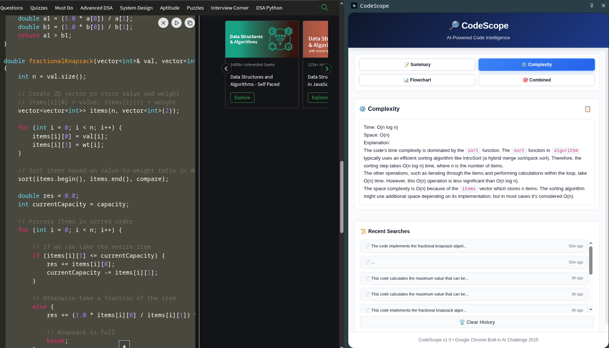
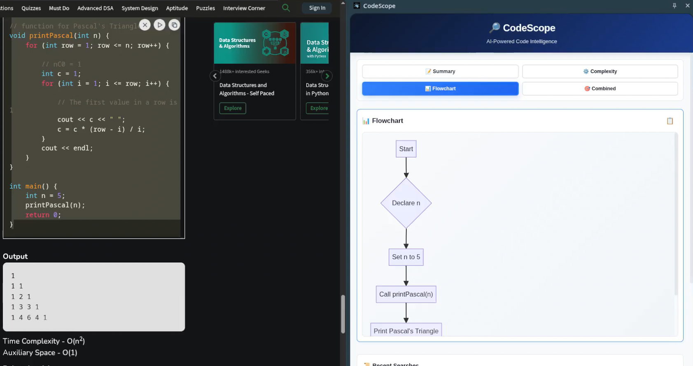
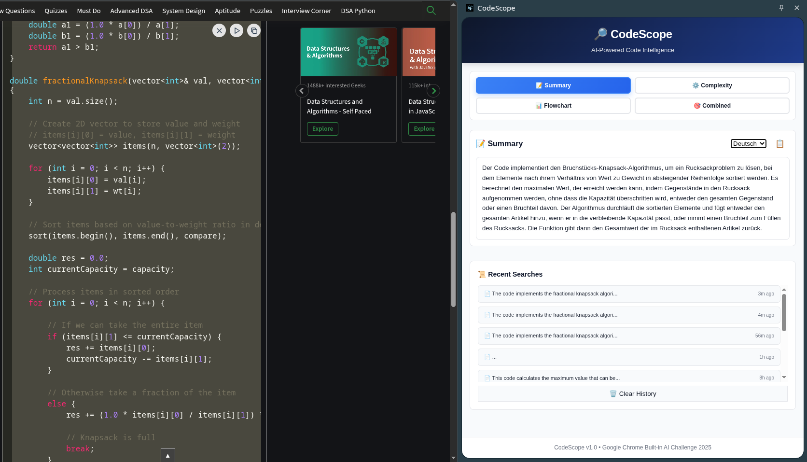

# CodeScope

<div align="center">
  
  
  
  
  
  
  **A production-ready Chrome extension for the Google Chrome Built-in AI Challenge 2025 that analyzes code using Chrome's on-device AI models.**
  
  [](https://youtu.be/0l6BC5VBtpc)
</div>

## 📖 Description

CodeScope is an intelligent Chrome extension that leverages Chrome's built-in AI models to provide comprehensive code analysis directly in your browser. It offers code summarization, flowchart generation, and complexity analysis without requiring external API calls or data transmission.

## ✨ Features

- 🧠 **AI-Powered Code Summarization** - Generate intelligent summaries using Chrome's built-in AI
- 📊 **Interactive Flowchart Generation** - Automatic Mermaid diagram visualization of code logic
- 📈 **Complexity Analysis** - Big O time and space complexity assessment
- 📋 **Export Capabilities** - Copy Mermaid code for external rendering
- 🎛️ **Side Panel Interface** - Sleek side panel UI for enhanced user experience
- 📱 **Responsive Design** - Optimized layout for various screen sizes
- 🖱️ **One-Click Analysis** - Right-click context menu integration
- 🔄 **Scrollable Diagrams** - Large flowcharts scroll smoothly within the interface

## 🔧 Prerequisites

### System Requirements
- **Operating System**: Windows 10+, macOS 13+, Linux, or ChromeOS (Chromebook Plus)
- **Storage**: At least 22 GB free space
- **RAM**: 16 GB or more recommended
- **CPU**: 4 cores or more (or GPU with >4 GB VRAM)
- **Network**: Unlimited/unmetered connection (Wi-Fi or Ethernet preferred)

### Chrome Setup
1. **Chrome Browser** (Chrome 140+ - latest version)
2. **Enable AI Settings**:
   - Navigate to `chrome://settings/ai`
   - Turn ON "Use AI" (allows Chrome to download the model)
3. **Download AI Model Component** (CRITICAL STEP):
   - Go to `chrome://components`
   - Find "On-Device Model Execution Service"
   - Click **"Check for update"** button
   - Wait for download to complete (several hundred MB)
   - Restart Chrome completely

## 🚀 Installation

### Method 1: Clone from Repository

```bash
git clone https://github.com/Arunav47/CodeScope.git
cd CodeScope
```

### Method 2: Download ZIP

1. Download the repository as a ZIP file
2. Extract to your desired location

### Load Extension into Chrome

1. Open `chrome://extensions/` in Chrome
2. Enable **Developer mode** (toggle in top-right corner)
3. Click **Load unpacked**
4. Select the `CodeScope` folder
5. Extension appears in your Chrome toolbar

### Verify Installation

- Right-click any code text on a webpage
- Look for **"Analyze Code"** option in the context menu
- Click it to open the analysis side panel

## 📋 Usage

### Basic Analysis

1. **Select Code**: Highlight any code snippet on a webpage
2. **Right-Click**: Open the context menu
3. **Click "Analyze Code"**: Opens the analyzer in the side panel
4. **Wait for Results**: AI models process your code (~5-10 seconds)
5. **View Results**: See summary, flowchart, and complexity analysis

### Features Overview

- **Code Summary**: Get AI-generated explanations of what your code does
- **Flowchart**: Visual representation of code logic flow
- **Complexity Analysis**: Big O notation for time and space complexity
- **Export Options**: Copy Mermaid code for use in other tools

## 🏗️ Architecture

CodeScope leverages Chrome's built-in AI APIs for local processing:

- **Manifest V3**: Modern Chrome extension architecture
- **Service Worker**: Background script for context menu handling
- **Side Panel API**: Enhanced user interface experience
- **Chrome AI APIs**: Summarizer and Prompt APIs for on-device processing
- **Mermaid.js**: Flowchart generation and rendering


## 🛠️ Troubleshooting

### ⚠️ "AI Model Not Ready" Error (Most Common)

This indicates the on-device AI model hasn't been downloaded yet. **This is normal on first use!**

**Solution:**
1. Navigate to `chrome://settings/ai` and turn ON "Use AI"
2. Go to `chrome://components`
3. Find "On-Device Model Execution Service" or "Optimization Guide On Device Model"
4. Click **"Check for update"** button (version shows 0.0.0.0 initially)
5. Wait for "Component updated" message (download takes 5-10 minutes)
6. Go to `chrome://flags`
7. Enable "optimization-guide-on-device-model" and "prompt-api-for-gemini-nano".
8. **Completely quit Chrome** (not just close windows)
9. **Restart Chrome**
10. Try the extension again

### "Chrome AI API not found"
- Ensure you're using Chrome 140 or later
- Download from [Chrome Dev](https://www.google.com/chrome/dev/) or [Chrome Canary](https://www.google.com/chrome/canary/)
- Verify you're not using a different browser (Edge, Firefox, etc.)

### Extension Context Menu Missing
- Reload extension: Go to `chrome://extensions` → Find CodeScope → Click reload
- Ensure you're selecting text before right-clicking
- Try on a different website

### Blank or Incomplete Results
- Wait 10-15 seconds for AI processing on first use
- Use code snippets with at least 20 characters
- Check console for errors: Right-click side panel → Inspect → Console tab

## 📁 Project Structure

```
CodeScope/
├── manifest.json           # Extension configuration (Manifest V3)
├── service-worker.js       # Background script (context menu handler)
├── content-script.js       # Content script for webpage interaction
├── popup.html              # Side panel UI template
├── popup.js                # Main AI analysis logic
├── styles.css              # Styling and animations
├── mermaid.min.js          # Mermaid library for flowcharts
├── icons/                  # Extension icons
│   ├── icon16.png
│   ├── icon32.png
│   ├── icon48.png
│   └── icon128.png
├── LICENSE                 # MIT License
└── README.md               # This documentation
```

## 🛠️ Built With

| Component | Technology |
|-----------|----------|
| **Language** | JavaScript (ES2020+) |
| **Framework** | Chrome Extension API (Manifest V3) |
| **AI Models** | Chrome Gemini Nano (on-device) |
| **APIs** | Chrome Summarizer API, Prompt API |
| **UI Framework** | Vanilla HTML/CSS/JavaScript |
| **Diagrams** | Mermaid.js |
| **Build Process** | Zero-config (no build step required) |

## 🤝 Contributing

Contributions are welcome! Please feel free to submit a Pull Request.

### Development Setup

1. Fork the repository
2. Create your feature branch (`git checkout -b feature/AmazingFeature`)
3. Make your changes
4. Test the extension locally
5. Commit your changes (`git commit -m 'Add some AmazingFeature'`)
6. Push to the branch (`git push origin feature/AmazingFeature`)
7. Open a Pull Request

### Guidelines

- Follow existing code style and conventions
- Test your changes thoroughly
- Update documentation as needed
- Ensure compatibility with Chrome 140+

## 📄 License

This project is licensed under the MIT License - see the [LICENSE](LICENSE) file for details.

## 🆘 Support

If you encounter any issues or have questions:

1. Check the [Troubleshooting](#-troubleshooting) section
2. Search existing [issues](https://github.com/Arunav47/CodeScope/issues)
3. Create a new issue with detailed information

## 📸 Screenshots & Demo

### 🎬 Video Demo

<p align="center">
  <a href="https://youtu.be/0l6BC5VBtpc">
    
  </a>
</p>

<p align="center">
  <em>👆 Click the image above to watch the full demo on YouTube</em>
</p>

### 🖼️ Application Screenshots

<div align="center">

#### Extension Side Panel Interface


#### AI Code Analysis in Action


#### Flowchart Generation


#### Context Menu Integration  


</div>

### ✨ Key Features Demonstrated
- **Right-click Context Menu**: Easy access to code analysis
- **Side Panel Interface**: Clean and intuitive user experience
- **AI-Powered Summaries**: Intelligent code explanations
- **Interactive Flowcharts**: Visual code logic representation
- **Complexity Analysis**: Big O notation assessment
- **Export Capabilities**: Copy Mermaid diagrams for external use

## 🏆 Acknowledgments

- Built for the **Google Chrome Built-in AI Challenge 2025**
- Powered by Chrome's on-device AI models
- Mermaid.js for flowchart generation
- Chrome Extension API documentation and community

---

**Made with ❤️ for the Chrome Built-in AI Challenge 2025**
